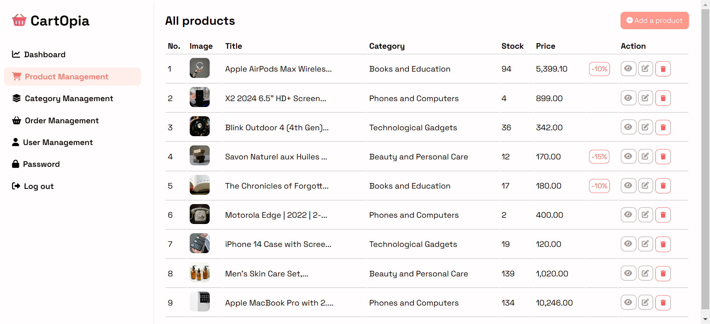

# CartOpia - E-commerce Project
## Overview
CartOpia is a full-featured e-commerce website built using PHP, MySQL, HTML, CSS, and JavaScript. The project integrates third-party libraries and services such as Animate.css for UI animations, Stripe for payment processing, and dompdf for generating PDF invoices. The platform offers a seamless shopping experience with dynamic product listings, user management, and secure checkout functionality.

  

## Technologies Used
- **Backend:** PHP (Core functionality, server-side logic), MySQL (Relational database for storing various data).

- **Frontend:** HTML5, CSS3, JavaScript (UI/UX design and interactivity)

## Libraries and Packages

- **Animate.css**- CSS animations for smoother user interactions.

- **Stripe**- Payment gateway integration for secure transactions.

- **dompdf** - PDF generation for invoices.

## ER diagram
  
## Features
- **Shopping Cart:** Dynamic cart functionality with product quantity adjustments.

- **Wishlist** – Save products for future purchases.  

- **Product Filters** – Filter by category, price, and more.  

- **Review System** – Leave feedback for purchased products. 

- **Payment Integration** – Stripe API for secure payment processing.

- **PDF Generation** – Invoices are automatically generated using dompdf.

- **Authentication and Authorization** – 
   - Secure login and signup with role-based access.  
   - Guest, User, and Admin permissions ensure data security and prevent unauthorized actions.  
   - Password recovery and reset functionalities. 

## User Roles and Permissions
### Guest
- **Browse Products** – View the entire catalog of products.  

- **Add/Remove from Cart** – Seamlessly add products to the cart or remove them as needed.  

- **Add to Wishlist** – Save products for later by adding them to your wishlist.  

- **Filter Products** – Narrow down products by category, price, or other filters.  

- **Sign Up** – Create an account to unlock more features.  

### User (Authenticated)
- **Login/Logout** – Access and secure user-specific data.  

- **Checkout** – Complete purchases by entering delivery details.  

- **Payments** – Secure payment integration via Stripe.  

- **Dashboard** – View personal metrics, and account activity.  

- **Order History** – Track previous orders and view detailed receipts.  

- **Print Invoices** – Generate PDF invoices using dompdf.  

- **Manage Account** – Update personal details and change passwords. 

- **Review Products** – Leave reviews for shipped products to share feedback.  

### Admin 
- **Login/Logout** – Secure access to the admin dashboard.  

- **Admin Dashboard** – Visualize various site metrics, including sales and user activity.  

- **Manage Products** – Add, edit, or delete products from the store.  

- **Manage Categories** – Organize and oversee product categories.  

- **Manage Orders** – View, process, and update order statuses.  

- **Manage Users** – Edit user information or remove users.  

- **Manage Reviews** – Moderate or delete product reviews.  

- **Change Password** – Secure admin account by updating credentials.  

## Installation and Setup
1. Clone the repository:
`git clone https://github.com/jihanebouazza/CartOpia.git`
2. Navigate to the project directory:
`cd CartOpia`
3. Set up the environment:
 	- Configure your database in src/config.php.
 	- Create src/stripe.php and add the code below and update your Stripe API keys.
 ```ruby
 define('STRIPE_API_KEY','PRIVATE_KEY');
define('STRIPE_PUBLISHABLE_KEY','PUBLIC_KEY');
define('STRIPE_SUCCESS_URL','http://localhost/cartopia/public/views/products/success.php');
define('STRIPE_CANCEL_URL','http://localhost/cartopia/public/views/products/cancel.php');
 ```
4. Install dependencies:
`composer install`
5. Start the development server:
navigate to [http://localhost/CartOpia/public/](http://localhost/CartOpia/public/) 

## Screenshots
### Landing Page
  
### Products Page
  
### Single Product Page
  
### FAQ Page
  
### Log in Page
  
### Sign up Page
  
### Cart Page
  
### Wishlist Page
  
### User Dashboard Page
  
### Order History Page
  
### Account Settings Page
  
### Change Password Page
  
### Admin Dashboard Page
  
### Product Management Page
  
### Category Management Page
  
### Order Management Page
  
### User Management Page
  
### Change Password Page for Admin
  

## Contribution
Feel free to fork the project and submit pull requests. For major changes, please open an issue first to discuss what you would like to implement.